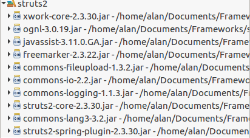
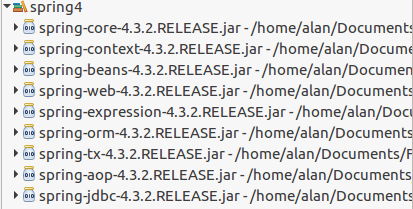
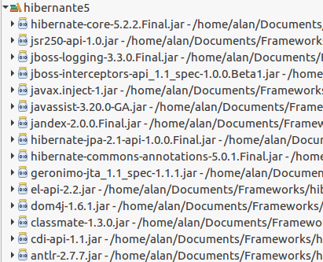
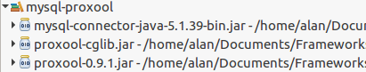
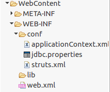

SSH环境搭建
==========

## 一、导入相应的jar包

 * struts2
 

 * spring4
 

 * hibernate5
 

 * mysql
 

## 一、配置XML
	
我的目录分布：


 * web.xml

	```
	<?xml version="1.0" encoding="UTF-8"?>
	<web-app xmlns:xsi="http://www.w3.org/2001/XMLSchema-instance"
	    xmlns="http://xmlns.jcp.org/xml/ns/javaee"
	    xsi:schemaLocation="http://xmlns.jcp.org/xml/ns/javaee http://xmlns.jcp.org/xml/ns/javaee/web-app_3_1.xsd"
	    id="WebApp_ID" version="3.1">
	    <display-name>TBS</display-name>
	    <filter>
	        <filter-name>struts</filter-name>
	        <filter-class>org.apache.struts2.dispatcher.ng.filter.StrutsPrepareAndExecuteFilter</filter-class>
	        <init-param> 
		        <param-name>config</param-name> 
		        <param-value>struts-default.xml,struts-plugin.xml,../conf/struts.xml</param-value> 
		    </init-param> 
	    </filter>
	    
	    <filter-mapping>
	        <filter-name>struts</filter-name>
	        <url-pattern>/*</url-pattern>
	    </filter-mapping>
	    
	    <listener>
			<listener-class>org.springframework.web.context.ContextLoaderListener</listener-class>
		</listener>
		
		<context-param>
			<param-name>contextConfigLocation</param-name>
			<param-value>/WEB-INF/conf/applicationContext.xml</param-value>
		</context-param>
		
	    <welcome-file-list>
	        <welcome-file>index.html</welcome-file>
	        <welcome-file>index.htm</welcome-file>
	        <welcome-file>index.jsp</welcome-file>
	        <welcome-file>default.html</welcome-file>
	        <welcome-file>default.htm</welcome-file>
	        <welcome-file>default.jsp</welcome-file>
	    </welcome-file-list>
	</web-app>
	```

 * struts.xml
	```
	<?xml version="1.0" encoding="UTF-8"?>
	<!DOCTYPE struts PUBLIC
		"-//Apache Software Foundation//DTD Struts Configuration 2.3//EN"
		"http://struts.apache.org/dtds/struts-2.3.dtd">
	<struts>
		<package name="default" namespace="/" extends="struts-default">
			<default-action-ref name="APIDoc" />
			
			<action name="APIDoc" class="APIAction">
				<result name="success">/APIDoc.jsp</result>
			</action>		
		</package>
		
		<!-- package 可以继承 -->
		<package name="movie" namespace="/movie" extends="default">
			<action name="*" class="APIAction" method="getMovie" />
		</package>
	</struts>
	```

 * applicationContext.xml
	```
	<?xml version="1.0" encoding="UTF-8"?>
	<beans xmlns="http://www.springframework.org/schema/beans"
		xmlns:xsi="http://www.w3.org/2001/XMLSchema-instance" xmlns:p="http://www.springframework.org/schema/p"
		xmlns:context="http://www.springframework.org/schema/context"
		xmlns:tx="http://www.springframework.org/schema/tx"
		xmlns:aop="http://www.springframework.org/schema/aop"
		xsi:schemaLocation="
		http://www.springframework.org/schema/beans 
		http://www.springframework.org/schema/beans/spring-beans-3.1.xsd
		http://www.springframework.org/schema/context 
		http://www.springframework.org/schema/context/spring-context-3.1.xsd ">
		
		<context:property-placeholder ignore-unresolvable="true" location="classpath:../conf/jdbc.properties" />
		
		<!-- 配置数据源 -->
		<bean id="dataSource" class="org.logicalcobwebs.proxool.ProxoolDataSource">
			<property name="driver" value="com.mysql.jdbc.Driver" />
			<property name="driverUrl" value="${jdbc.url}" />
			<property name="user" value="${jdbc.user}" />
			<property name="password" value="${jdbc.password}" />
			<property name="alias" value="proxoolPool" />
			<property name="houseKeepingSleepTime" value="90000" />
			<property name="prototypeCount" value="5" />
			<property name="maximumConnectionCount" value="50" />
			<property name="minimumConnectionCount" value="2" />
			<property name="simultaneousBuildThrottle" value="50" />
			<property name="maximumConnectionLifetime" value="14400000" />
			<property name="houseKeepingTestSql" value="select CURRENT_DATE" />
		</bean>
		
		<!-- 定义Hibernate的sessionFactory -->
		<bean id="sessionFactory" class="org.springframework.orm.hibernate5.LocalSessionFactoryBean">
			<property name="dataSource" ref="dataSource" />
			<property name="hibernateProperties">
				<props>
					<!-- 数据库连接方言 -->
					<prop key="hibernate.dialect">org.hibernate.dialect.MySQLDialect</prop>
					<!-- 在控制台输出SQL语句 -->
					<prop key="hibernate.show_sql">true</prop>
					<!-- 格式化控制台输出的SQL语句 -->
					<prop key="hibernate.format_sql">true</prop>
					<prop key="hibernate.connection.release_mode">after_statement</prop>
					<prop key="hibernate.hbm2ddl.auto">update</prop>
				</props>
			</property>
			<property name="mappingLocations">
				<value>classpath:/priv/dbs/model/*.hbm.xml</value>
			</property>
		</bean>

		<!-- 定义事务管理器（声明式的事务） -->
		<bean id="transactionManager" class="org.springframework.orm.hibernate5.HibernateTransactionManager">
			<property name="sessionFactory" ref="sessionFactory" />
		</bean>
		
		<!-- 定义事务 -->
		<bean id="transactionInterceptor" class="org.springframework.transaction.interceptor.TransactionInterceptor">
			<property name="transactionManager" ref="transactionManager" />
			<property name="transactionAttributes">
				<props>			
					<prop key="get*">PROPAGATION_REQUIRED,readOnly</prop>
					<prop key="update*">PROPAGATION_REQUIRED</prop>
					<prop key="save*">PROPAGATION_REQUIRED</prop>
					<prop key="add*">PROPAGATION_REQUIRED</prop>
					<prop key="edit*">PROPAGATION_REQUIRED</prop>
					<prop key="delete*">PROPAGATION_REQUIRED</prop>
				</props>
			</property>
		</bean>
		
		<!-- aop管理事务 -->
		<bean class="org.springframework.aop.framework.autoproxy.BeanNameAutoProxyCreator">
			<property name="beanNames">
				<value>*Dao</value>
			</property>
			<property name="interceptorNames">
				<value>transactionInterceptor</value>
			</property>
		</bean>
		
		<!-- Action -->
		<bean id="APIAction" class="priv.dbs.action.APIAction">
			<property name="apiService" ref="APIService" />
		</bean>
		
		<!-- Service -->
		<bean id="APIService" class="priv.dbs.service.APIService">
			<property name="apiDao" ref="APIDao" />
		</bean>
		
		<!-- Dao -->
		<bean id="APIDao" class="priv.dbs.dao.APIDao">
			<property name="sessionFactory" ref="sessionFactory" />
		</bean>
	</beans>
 	```

 * jdbc.properties
	```
	jdbc.url=jdbc:mysql\:///db?useUnicode\=true&characterEncoding\=UTF-8&useSSL\=false
	jdbc.user=user
	jdbc.password=password
	```