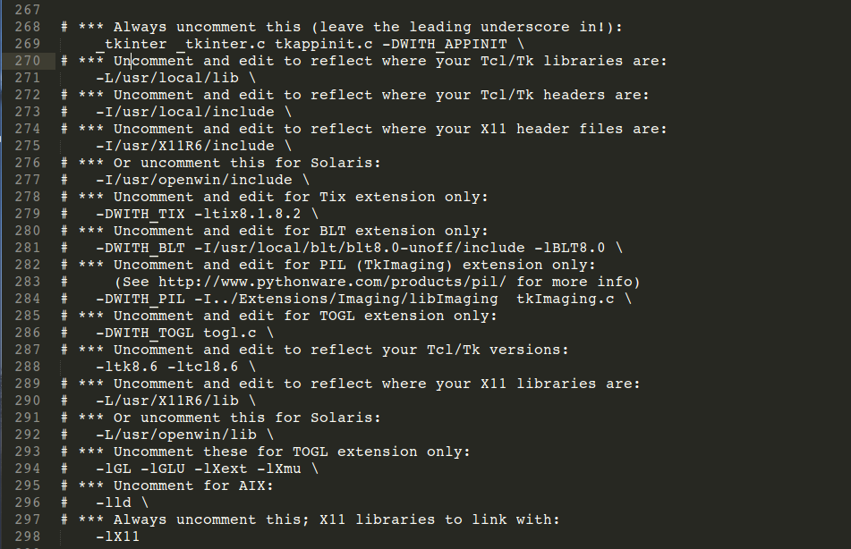

ubuntu16.04相关问题
==================

# ubuntu16.04安装tcl/tk和Tkinter
## 问题描述：

运行python文件时出现以下信息：

```
cryhelyxx@ada:~/python_workspace$ python httpurl.py   
Traceback (most recent call last):  
  File "httpurl.py", line 4, in <module>  
    import Tkinter  
  File "/usr/local/lib/python2.7/lib-tk/Tkinter.py", line 39, in <module>  
    import _tkinter # If this fails your Python may not be configured for Tk  
ImportError: No module named _tkinter  
```

## 解决方法：

1. 终端输入安装Tkinter:

    `sudo apt-get install python-tk`

2. 安装tcl和tk

    tcl和tk的下载地址：https://sourceforge.net/projects/tcl/files/Tcl/

    目前我下载的tcl/tk源代码包是 tcl8.6.6-src.tar.gz 和 tk8.6.6-src.tar.gz

    (1) 安装tcl8.6：
        ```
        tar -xzvf tcl8.6.6-src.tar.gz  
        cd tcl8.6.6/unix
        ./configure
        make
        sudo make install
        ```

    (2)安装tk8.6（与tcl8.6的安装相似）:
        编译时如果出现以下错误信息：
        ```
        /home/cryhelyxx/下载/tk8.6.6/unix/../generic/tk.h:96:25: 致命错误： X11/Xlib.h：没有那个文件或目录  
        编译中断。  
        make: *** [tk3d.o] 错误 1  
        ```
        由在终端运行：
            `sudo apt-get install libx11-dev`

3. 修改Setup.dist文件

    进行python安装包解压后那个文件夹里， 命令打开Setup.dise文件：
    `vim Modules/Setup.dist`
    
    
    修改上面5处地方， 把她们前面的＃删除掉， 默认的tcl和tk是8.2, 等下， 看上面第2步， 可以知道已经安装的tcl和tk的版本是8.6, 那么我们就将这里的tk8.3和tcl8.2修改为tk8.6和tcl8.6, 保存退出。

4. 现在重装python3.6.0， 用以下命令一次性完成配置、编译、安装：
    
    ```
    ./configure
    make
    sudo make install
    ```


# Ubuntu下Chrome使用Flash

1. 首先下载pep版的flash解压之后放/opt/google/chrome/PepperFlash目录，PepperFlash这个文件夹现在是没有里需要自己新建的，然后把解压出来的libpepflashplayer.so和manifest.json文件放/PepperFlash目录里（这些步骤需要root权限）

2. 打开/usr/share/applications目录，找到GoogleChrome的启动器，右键--属性，在命令这行后面加入 --ppapi-flash-path=/opt/google/chrome/PepperFlash/libpepflashplayer.so 记住空格隔开（这里也要root权限操作，用文本编辑器也可以修改）然后保存。


# Ubuntu终端显示Git的分支

在~/目录下的.bashrc末尾加上如下
`PS1='${debian_chroot:+($debian_chroot)}\[\033[01;32m\]\u@\h\[\033[00m\]:\[\033[01;34m\]\w\[\033[00m\]$(__git_ps1 " (%s)")\$ '`

# Ubuntu更新Git
```
sudo add-apt-repository ppa:git-core/ppa
sudo apt-get update
sudo apt-get install git
```